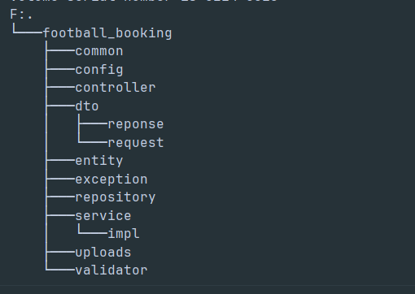

# Football Booking Manager

   

## 📖 Project Overview

**Football Booking Manager** is a web application designed to manage football field bookings. The project provides key features such as booking football fields, managing invoices, and handling inventory for additional items (e.g., water, snacks). It is built as a RESTful API using **Spring Boot** (Java) and **MySQL**, with user authentication and role-based access control implemented using JWT.

This project was developed as part of my personal learning journey to deepen my understanding of backend development, Spring Boot, and RESTful API design.

---

## 🚀 Key Features

- **Football Field Booking**:
  - Users can book a field for a specific time slot.
  - Check booking status (PENDING, CONFIRMED, CANCELED).
- **Invoice Management**:
  - Create invoices for bookings, including additional items.
  - Update invoices (add or accumulate item quantities).
  - Delete invoices by `invoiceId` or by `bookingId`.
  - Retrieve a list of invoices by `bookingId`.
- **Inventory Management**:
  - Check item stock availability before creating or updating invoices.
  - Automatically restore stock when deleting invoices.
- **Authentication and Authorization**:
  - Uses JWT (JSON Web Token) for user authentication.
  - Role-based access: ADMIN can manage all operations, while USER can only view and manage their own bookings.

---

## 🛠 Technologies Used

- **Backend**: Spring Boot 3.2.0 (Java 17)
- **Database**: MySQL 8.0
- **Authentication**: Spring Security with JWT
- **Logging**: SLF4J with Logback
- **Build Tool**: Maven
- **API Testing Tool**: Postman

---

## 📂 Project Structure



---

## ⚙️ Setup and Installation

### Prerequisites

- Java 17
- Maven 3.6+
- MySQL 8.0
- Postman (for API testing)

### Installation Steps

1.  **Clone the Repository**:
    ```bash
    git clone https://github.com/tronghoB211963/football-booking.git
    cd football-booking
    ```
2.  **Configure the Database**

    ```bash
    //create a DB
    CREATE DATABASE football_booking;

    //Update the database configuration in src/main/resources/application.properties:

    spring.datasource.url=jdbc:mysql://localhost:3306/football_booking
    spring.datasource.username=your_username
    spring.datasource.password=your_password
    spring.jpa.hibernate.ddl-auto=update
    ```

3.  **Configure JWT**
    ```bash
    jwt.secret=your_jwt_secret_key
    jwt.expiration=86400000
    ```
4.  **Run the Application**
    ```bash
    mvn clean install
    mvn spring-boot:run
